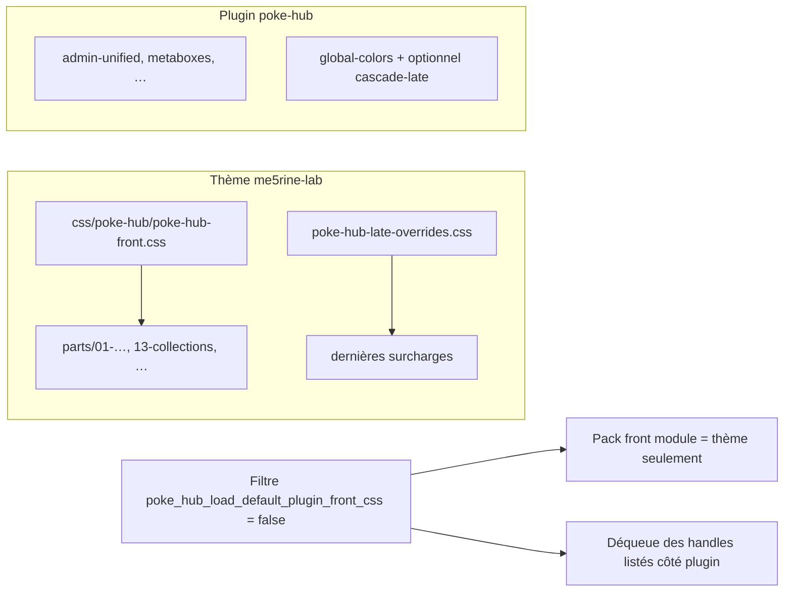

# CSS front : thème vs plugin (migration)

Ce document est la **référence** pour le chargement du CSS public Poké HUB : ce qui vit dans le **thème** (en particulier **Me5rine Lab**), ce qui reste dans le **plugin**, et le filtre WordPress qui bascule d’un mode à l’autre.

## En bref — règle unique (production Me5rine Lab)

| Où ? | Contenu | Quand c’est utilisé |
|------|---------|----------------------|
| **Thème enfant** `me5rine-lab/css/poke-hub/` | Tout le **CSS public** des modules (collections, blocs, profils, friend codes, variables `me5rine-lab-*`, etc.) : `poke-hub-front.css` → `@import` des `parts/*.css`, puis `poke-hub-late-overrides.css` en **dernière** couche. | Toujours en prod sur Me5rine Lab : c’est la **seule** source de vérité visuelle front pour le « gros lot ». |
| **Plugin** `poke-hub/assets/css/` | **Minimum** : surtout **admin** ; `global-colors.css` (notices, cohérence, besoins Gutenberg) ; parfois un **filet** optionnel `poke-hub-collections-cascade-late.css` (voir tableau ci‑dessous). | Le plugin **n’enfile plus** le pack `poke-hub-*-front` du dossier `assets/css/` quand le filtre ci‑dessous est à `false` (le thème a déjà tout repris). |

**Filtre WordPress** : `poke_hub_load_default_plugin_front_css`

- Thème Me5rine : `add_filter( 'poke_hub_load_default_plugin_front_css', '__return_false' );` dans `functions.php` du thème enfant.
- Comportement : les appels à `poke_hub_enqueue_bundled_front_style()` **ne chargent plus** les feuilles listées côté plugin ; le hook `poke_hub_maybe_dequeue_plugin_front_styles` **retire** les handles connus (voir `poke_hub_get_plugin_front_style_handles()` dans `includes/functions/pokehub-front-styles-bridge.php`) pour éviter **toute double charge**.

**Sites sans ce thème** (ou en phase de test) : laisser le filtre par défaut à `true` : le plugin charge les `assets/css/poke-hub-*-front.css` **s’ils existent** dans le dépôt du plugin.

*Point d’entrée côté thème (dépôt me5rine-lab) : `css/poke-hub/README.md`.*

## Objectif

- **Une seule source de vérité** pour l’intégration visuelle (variables `me5rine-lab-*`, composants, modules) : le thème enfant, pas des doublons `assets/css/*.css` côté plugin en production.
- **Ordre de cascade** explicite : d’abord le thème parent (Hello Elementor), puis la base **Me5rine Lab**, puis la couche **Poké HUB** (surcharge plugin / correctifs ciblés).
- Le plugin conserve le **minimum** : styles **admin**, **`global-colors.css`** (Gutenberg, notices, alignement sur la charte), et éventuellement de **petits correctifs** front optionnels (voir plus bas).

## Filtre : `poke_hub_load_default_plugin_front_css`

- **Défaut** : `true` — le plugin enfile les feuilles listées dans `includes/functions/pokehub-front-styles-bridge.php` via `poke_hub_enqueue_bundled_front_style()` / handles enregistrés par les modules, **uniquement si** le fichier correspondant existe sous `assets/css/`.
- **Thème Me5rine Lab (production)** : le thème enfant retourne `false` sur ce filtre (`add_filter( 'poke_hub_load_default_plugin_front_css', '__return_false' );` dans `functions.php` du thème). Le hook `poke_hub_maybe_dequeue_plugin_front_styles` **désenfile** alors tous les handles enregistrés via `poke_hub_get_plugin_front_style_handles()` (y compris les styles front des modules) pour éviter toute **double** charge.
- **Intégration manuelle d’un thème tiers** : même principe — fournir l’équivalent du lot front (ou un sous-ensemble) dans le thème, puis `__return_false` sur le filtre. Voir aussi [THEME_INTEGRATION.md](./THEME_INTEGRATION.md) (méthode par copie depuis **FRONT_CSS.md** / **CSS_RULES.md** si vous ne reprenez pas le dépôt du thème Me5rine).

## Ce qui reste dans le plugin (`assets/css/`)

| Fichier / rôle | Rôle |
|----------------|------|
| `global-colors.css` | Variables notices / couleurs partagées (admin + besoins Gutenberg) ; **toujours** pertinent. |
| `admin-unified.css`, `pokehub-metaboxes-admin.css` | Administration uniquement. |
| `poke-hub-collections-cascade-late.css` | **Optionnel** : filet de secours (cascade) pour Collections ; enfilé par le module quand le filtre `poke_hub_enqueue_collections_cascade_late` vaut `true` (défaut), **hors** logique `poke_hub_enqueue_bundled_front_style` — il n’est **pas** dans la liste `poke_hub_get_plugin_front_style_handles()` afin d’exister aussi lorsque le lot front « packagé » est désactivé. Désactiver : `add_filter( 'poke_hub_enqueue_collections_cascade_late', '__return_false' );` |
| Fichiers `poke-hub-*-front.css` historiques | S’ils sont **absents** du dépôt, les modules n’enquent rien de ce côté ; le thème fournit l’équivalent. |

Code : `includes/functions/pokehub-front-styles-bridge.php` (helpers, liste des handles, déqueue).

## Thème enfant Me5rine Lab (référence)

### Ordre de chargement (front)

1. **Thème parent** (Hello Elementor) — handles tels que `hello-elementor`, `hello-elementor-theme-style`, etc.
2. **Me5rine Lab** — handle `me5rine-child-style` (fichier servi via `style-handler.php` d’après `style.css` : intégrations, formulaires, tableaux, dashboard, profils, menu, **responsive** `css/responsive.css`, **um** `css/um-responsive.css`). **Aucun** import Poké HUB dans ce `style.css`.
3. **Poké HUB** — enqueued **après** `me5rine-child-style` (priorité `100000` dans le `functions.php` du thème) :
   - `me5rine-poke-hub-front` → `css/poke-hub/poke-hub-front.css` (consolide `parts/*.css` : `01-global-colors` reprend la logique partagée avec le plugin, modules, `13-collections-front`, `14-collections-theme`, etc.) ;
   - `me5rine-poke-hub-late` → `css/poke-hub/poke-hub-late-overrides.css` (correctifs de cascade, ex. Collections vs `dashboard.css` / responsive).

Commentaires détaillés : en-tête de `style.css` du thème enfant.

### Éditeur (blocs)

- `add_editor_style( 'css/poke-hub/poke-hub-front.css' );`
- `add_editor_style( 'css/poke-hub/poke-hub-late-overrides.css' );`  
  (après les styles éditeur existants, pour coller à l’ordre front.)

### Surcharges « collections thème »

Dégradés / variables spécifiques : voir le part **`parts/14-collections-theme.css`**, importé par `poke-hub-front.css` (et non plus un fichier orphelin sous `assets/theme/` du plugin).

## Fichiers de référence (dépôt thème, hors plugin)

- `me5rine-lab/style.css` — plan de l’enchaînement me5rine.
- `me5rine-lab/functions.php` — variables dynamiques, enqueue `me5rine-child-style`, couche Poké HUB, filtre `poke_hub_load_default_plugin_front_css`, `add_editor_style`.
- `me5rine-lab/css/poke-hub/README.md` — point d’entrée rapide du dossier.
- `me5rine-lab/css/poke-hub/poke-hub-front.css` — imports des `parts/`.

## Documentation liée

- [THEME_INTEGRATION.md](./THEME_INTEGRATION.md) — guide plus large (héritage : ce document + thèmes sans bundle).
- [ORGANISATION.md](./ORGANISATION.md) — structure du plugin et dossier `assets/`.
- [POKEHUB_CSS_CLASSES.md](./POKEHUB_CSS_CLASSES.md) — classes `pokehub-*` et liens avec `me5rine-lab-*`.
- [FRONT_CSS.md](./FRONT_CSS.md) — référence historique / variables (peut alimenter un thème minimal si vous copiez le contenu).
- [CSS_SYSTEM.md](./CSS_SYSTEM.md) — système de classes.

---

*Index de la documentation : [README du dossier docs](README.md) · [Charte rédactionnelle](REDACTION.md)*
